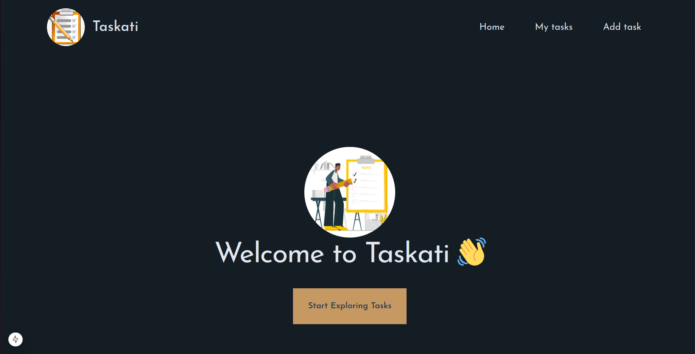
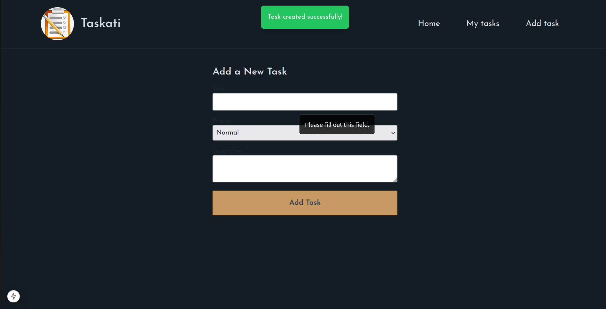
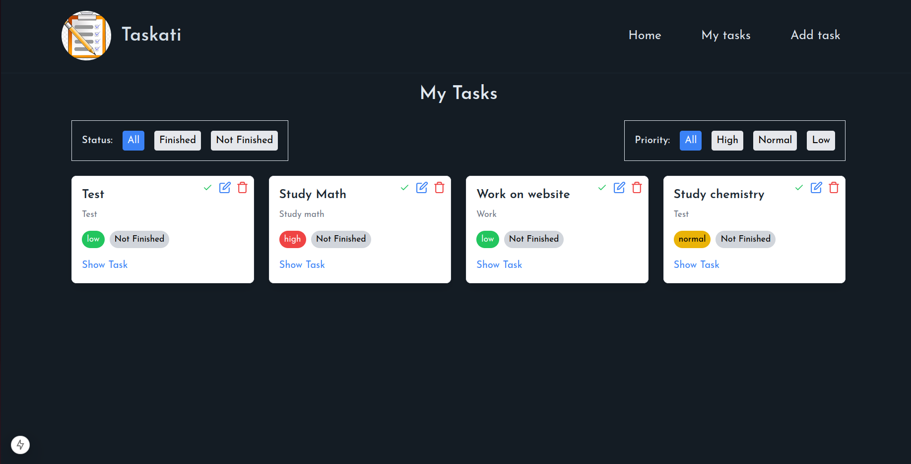
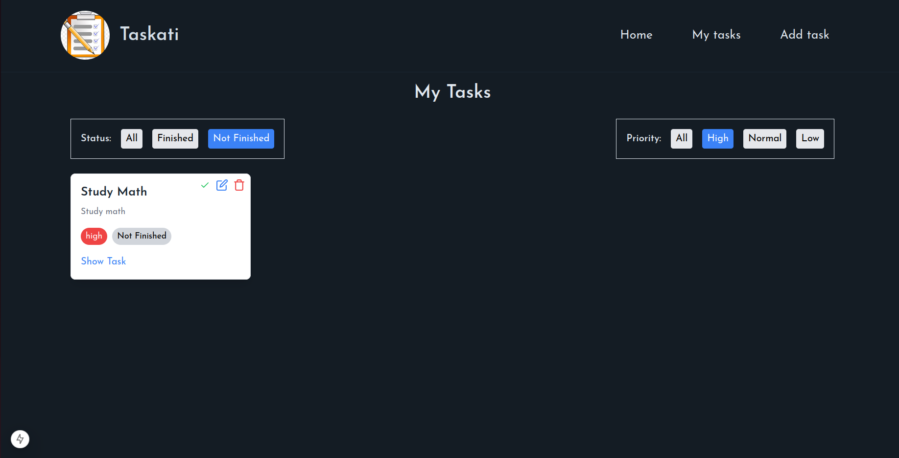

# Taskati

A simple, intuitive task management application built with Next.js, TypeScript, and Tailwind CSS, allowing users to create, view, and manage tasks with filters and a detailed task view.

## Table of Contents

- [Features](#features)
- [Installation](#installation)
- [Usage](#usage)
- [Components and Structure](#components-and-structure)
- [Screenshots](#screenshots)

## Features

- Create, update, and delete tasks
- Filter tasks by priority and status
- Detailed view for each task
- Data persistence using `localStorage`
- Responsive design for mobile and desktop

## Installation

1. Clone the repository:
   ```bash
   git clone https://github.com/your-username/task-manager-app.git
   ```
2. cd task-manager-app

3. npm install

4. npm run dev

## Usage

- **Adding Tasks**: Click the "Add Task" button on the main page to create a new task.
- **Filtering Tasks**: Use the filters for status and priority to organize tasks effectively.
- **Task Details**: Click on a task to view detailed information and manage it.

## Components and Structure

- **TaskProvider**: Provides global state management for tasks, handles `localStorage` persistence.
- **TaskCard**: Displays task details on the main page with options to edit or delete.
- **TaskDetails**: A dedicated page that shows detailed information about a task.
- **Filter**: A reusable component for filtering tasks by different criteria.
- **Toast**: Displays notifications for actions like adding or deleting tasks.

## Screenshots

### Main Page



### Create Task



### Tasks Page



### Filters


